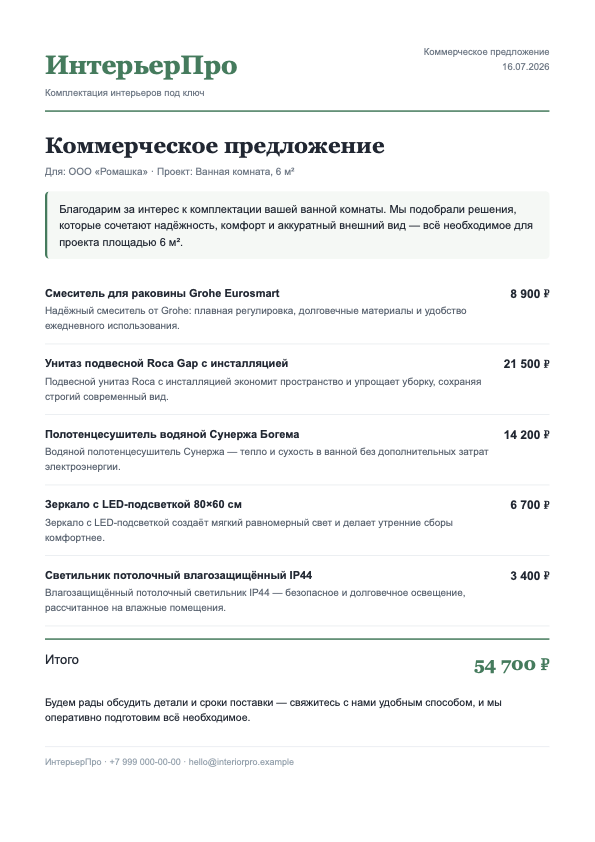
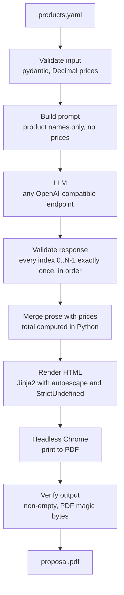

# AI Proposal Generator

[](https://github.com/Shcherbin96/ai-proposal-generator/actions/workflows/ci.yml)


Turns a YAML product list into a branded, client-ready commercial proposal PDF (КП — *kommercheskoe predlozhenie*, the standard Russian sales document). An LLM writes the prose; Python owns every number. Prices never enter the prompt, the model's reply is rejected unless it covers every product exactly once in order, and the total is computed from the input file — hallucinated numbers are impossible by architecture, not by hope.

The core is deliberately small — about 480 lines of code across seven modules. The point of this project is not volume; it is the production-grade shell around an LLM call: strict data contracts on both sides of the model, typed failures with meaningful exit codes, injection-safe rendering, verified output, and 116 offline tests running on three operating systems in CI. There is more test code than production code. That ratio is the point.



## The problem

A small interior-supply business assembles a commercial proposal for every inquiry: an intro tailored to the client, a benefit line for each product, prices, a total, a closing. Done by hand in a word processor, one proposal took about 3 hours — most of it formatting and rewriting the same kinds of sentences.

This tool produces the same document in about 2 minutes: edit the product list, run one command, send the PDF. The prose is generated fresh for each client and project; the numbers are copied and summed by code, so the document is safe to send without proofreading the math.

## How it works



The pipeline is four logged stages (`generate.py`): load and validate input, request and validate prose, render HTML, print and verify the PDF. Each stage either succeeds or raises a typed error with a specific exit code — there is no partially-written output to clean up. The intermediate `.html` file is deleted after a successful render and deliberately kept on failure, so the exact input Chrome saw can be inspected.

## The core design rule: LLM writes prose, code owns numbers

The LLM boundary is enforced in both directions by pydantic models (`models.py`):

**Into the model** goes the client name, project name, and a *numbered list of product names* — never prices. The prompt explicitly instructs the model not to mention prices or amounts ("pricing is handled separately") and not to invent technical specs. You can verify this in `llm.py:PROMPT_TEMPLATE`; a test (`test_prompt_contains_names_but_never_prices`) asserts no price from the input ever appears in the prompt.

**Out of the model** must come strict JSON: an intro, a closing, and one description per product, each carrying an **explicit index**. `validate_llm_content` rejects the response unless the indices are exactly `0..N-1` in order — no missing products, no duplicates, no reordering, no extras. A reply describing four of five products, or the same product twice, fails with exit code 69 instead of silently producing a wrong document. Only after this validation does a strict `zip` merge each description with its product's price.

**The numbers themselves** never round-trip through the model at all:

- Prices are parsed as `Decimal` with `decimal_places=2` enforced at the input boundary — sub-kopeck precision is rejected before it can break displayed arithmetic.
- The total is a `@property` on the validated input (`ProposalInput.total`), summed in Python. The docstring calls it what it is: "The one and only source of the total — never the LLM."
- The `money` template filter renders integral values with no decimals and fractional values with exactly two, so the displayed line items always sum to the displayed total — a document-arithmetic guarantee, covered by `test_money_line_items_sum_to_rendered_total`.

The result: the model can write a weak sentence, but it cannot corrupt a price, drop a product, or invent a discount.

## Quick start

Requirements: Python 3.12+, [uv](https://docs.astral.sh/uv/), and Google Chrome or Chromium.

```bash
git clone https://github.com/Shcherbin96/ai-proposal-generator.git
cd ai-proposal-generator
uv sync

cp .env.example .env   # then put your key in LLM_API_KEY
uv run python -m proposal_gen                    # uses data/products.yaml
uv run python -m proposal_gen my-products.yaml   # or your own list
# -> output/proposal.pdf
```

The default provider is Google Gemini (get a free key at [Google AI Studio](https://aistudio.google.com/apikey)); any OpenAI-compatible endpoint works — see [Configuration](#configuration).

Useful flags: `-o path/to/out.pdf` for the output location, `-v` for debug logging, `--help` for the full usage.

**Chrome** is discovered automatically: `PATH` lookup, macOS app bundles, Windows `Program Files` and per-user `%LOCALAPPDATA%` installs. If discovery fails, set `CHROME_PATH` to the browser binary.

- macOS: `brew install --cask google-chrome` (or any existing Chrome/Chromium install)
- Debian/Ubuntu: `sudo apt install chromium-browser` (or Google's `.deb`)
- Windows: a standard Chrome install, admin or per-user, is found automatically

**Try it without an API key** — regenerate the example PDF from a canned LLM response (Chrome is still required; it renders the PDF):

```bash
uv run python scripts/make_example.py
```

## Input format

`data/products.yaml`, abbreviated (the bundled sample has five products):

```yaml
client: "ООО «Ромашка»"
project: "Ванная комната, 6 м²"
products:
  - name: "Смеситель для раковины Grohe Eurosmart"
    price: 8900
  - name: "Унитаз подвесной Roca Gap с инсталляцией"
    price: 21500
```

Validation is strict: unknown keys are rejected (typo protection), names must be non-empty, prices must be positive with at most two decimal places, and at least one product is required. The generated prose follows the language of the input — Russian data produces a Russian proposal, English data English prose (though the single bundled template keeps ruble signs and the RU date format; see Limitations).

## Configuration

All configuration is via environment variables (or `.env`; see `.env.example`).

| Variable | Required | Default | Purpose |
|---|---|---|---|
| `LLM_API_KEY` | yes | — | API key for the provider |
| `LLM_BASE_URL` | no | `https://generativelanguage.googleapis.com/v1beta/openai/` | OpenAI-compatible endpoint |
| `LLM_MODEL` | no | `gemini-2.5-flash-lite` | Model name at that endpoint |
| `LLM_TIMEOUT_S` | no | `60` | Request timeout, seconds |
| `LLM_MAX_RETRIES` | no | `2` | **Transport-level** retries — network/HTTP failures, handled by the OpenAI SDK |
| `LLM_TEMPERATURE` | no | `0.4` | Sampling temperature, `0`–`2` |
| `LLM_JSON_MODE` | no | `true` | Request `response_format={"type": "json_object"}` from the provider |
| `LLM_MAX_REPAIRS` | no | `1` | **Content-level** retries — feeds the validation error back into the prompt on a contract-breaking reply, up to this many times |
| `CHROME_PATH` | no | auto-discovered | Full path to the Chrome/Chromium binary |

The defaults target Google Gemini's OpenAI-compatible endpoint, but nothing in the code is Gemini-specific: point `LLM_BASE_URL` and `LLM_MODEL` at OpenAI, Ollama, vLLM, or any other OpenAI-compatible server and it works unchanged. Numeric settings are validated at startup — a non-numeric timeout is a config error with exit code 78, not a mid-run traceback.

## Error handling

Every *expected* failure is a typed exception with a human-readable one-line message on stderr and a BSD `sysexits`-style exit code, so a wrapping script can tell "fix your YAML" apart from "the provider is down":

| Exit code | Class | Meaning | Example message |
|---|---|---|---|
| 65 (`EX_DATAERR`) | `InputError` | Invalid or unreadable input file | `Error: data/products.yaml: products.0.price: Input should be greater than 0` |
| 78 (`EX_CONFIG`) | `ConfigError` | Missing or invalid configuration | `Error: LLM_API_KEY is not set. Copy .env.example to .env and add your key ...` |
| 69 (`EX_UNAVAILABLE`) | `LLMError` | Provider call failed or the reply broke the contract | `Error: LLM response must describe all 5 products in order; got indices [0, 1, 1, 3, 4]` |
| 73 (`EX_CANTCREAT`) | `RenderError` | HTML/PDF rendering failed | `Error: Google Chrome / Chromium not found. Install it, or set CHROME_PATH to the full path of the browser binary.` |

The philosophy: expected failures are caught, classified, and explained; **unexpected failures traceback**. That is deliberate — an unknown bug should look like a bug, not be laundered into a polite message that hides the stack.

A contract-breaking LLM reply is not immediately fatal: it goes through up to `LLM_MAX_REPAIRS` repair attempts (the validation error is fed back to the model) before exit 69 is reported. Exit 69 means the repair budget, not just one attempt, is exhausted.

Note the last stage of the pipeline: a PDF is only reported as success after verification — Chrome exited 0, the file exists, it is non-empty, and it starts with the `%PDF-` magic bytes. "Chrome exited 0 but produced no PDF" is a real failure mode and it is tested.

## Security considerations

- **Template injection is closed off.** Jinja2 runs with `autoescape=True`, so neither client-supplied data (names arrive from an untrusted YAML file) nor LLM-generated prose can inject HTML or scripts into the document. `StrictUndefined` makes a missing variable a loud error instead of silent empty output. Both injection paths have dedicated tests.
- **Strict contracts on both boundaries.** Input YAML rejects unknown keys and malformed values; the LLM response is schema-validated and index-checked before anything touches the template.
- **The API key cannot leak through repr.** `Settings.api_key` is declared `repr=False`, so logging or printing the settings object never exposes it; a test asserts this. The key is never written to logs.
- **Prices are never sent to the model** — a data-minimization boundary as much as a correctness one.
- **Documented tradeoff:** client and project names *do* appear in INFO-level logs (pipeline stage messages). They are business data, not secrets; if your log destination is untrusted, route stderr accordingly.

## Testing

```bash
uv run pytest -q   # 116 passed, ~10 seconds, no API key, no network
```

All 116 tests run offline. The LLM is replaced by `FakeProvider`, a test double that replays `tests/fixtures/llm_response.json` — byte-for-byte the kind of reply a well-behaved model produces — and records every prompt it receives, so tests can assert on prompt contents (for example, that prices never appear in it). `FakeProvider` also accepts a list of responses, replayed as a one-shot queue, to drive the repair-loop tests through a bad-then-good sequence.

What is covered:

- **Contracts** — input schema violations, sub-kopeck prices, non-UTF-8 and non-mapping files; LLM replies with missing/duplicated/reordered indices, invalid JSON, unclosed code fences, empty completions.
- **Injection** — HTML in client data and in LLM prose is escaped in the rendered output.
- **Error paths** — every error class maps to its exit code through the real CLI; provider errors are wrapped, filesystem errors surface as `RenderError`.
- **PDF verification** — failed Chrome exit, timeout, exit-0-with-no-output, wrong magic bytes, and the intermediate-HTML lifecycle (deleted on success, kept on failure).
- **Cross-platform discovery** — `CHROME_PATH` override, missing-file override, per-user Windows installs via `LOCALAPPDATA`.
- **Repair loop** — bad JSON and contract violations followed by a good reply, repair budget exhaustion, and the guarantee that a transport-level failure is never mistaken for a repairable one.

Every real provider call is logged once at INFO — visible by default, no `-v` needed — with model, prompt version, latency, and prompt/completion/total token counts; `-v` adds full request/response debug logging on top.

Tests that need a real Chrome binary skip gracefully on machines without one — but CI runs a separate loud assertion (`find_chrome()` must succeed on every runner) so a runner image losing Chrome breaks the build instead of silently skipping the one path that cannot be tested any other way.

CI (`.github/workflows/ci.yml`) runs ruff lint, ruff format check, and strict mypy on Linux, and the full test suite on Ubuntu, macOS, and Windows, with least-privilege permissions (`contents: read`), per-ref concurrency cancellation, and job timeouts.

## Repository layout

```
ai-proposal-generator/
├── proposal_gen/
│   ├── models.py           # pydantic contracts for both boundaries: input YAML and LLM reply
│   ├── llm.py              # LLMProvider Protocol, OpenAI-compatible provider, prompt builder
│   ├── render.py           # autoescaped Jinja2, money filter, Chrome discovery, PDF verification
│   ├── generate.py         # 4-stage pipeline orchestration with per-stage logging
│   ├── config.py           # env-based settings with validation and secret-safe repr
│   ├── errors.py           # typed errors mapped to sysexits codes
│   ├── cli.py              # argparse entry point (python -m proposal_gen)
│   └── template.html       # branded A4 template (fonts, colors, layout)
├── tests/                  # 116 offline tests; fixtures/llm_response.json is the canned LLM reply
├── scripts/make_example.py # regenerates the example PDF offline, no API key needed
├── data/products.yaml      # sample input (Russian business case, by design)
├── docs/example-proposal.png
└── .github/workflows/ci.yml
```

## Limitations

- **One template.** Branding (company name, tagline, contacts) lives in `config.py`; layout and fonts in `template.html`. Changing the look means editing HTML/CSS — there is no theming system.
- **Web fonts need network at render time.** The template imports Google Fonts; offline, Chrome falls back to the system fonts declared in the stack (Arial/Georgia). The document stays correct, just less branded.
- **Sample data is Russian by design** — this is a real business case, not a toy. The pipeline itself is language-neutral: prose follows the input language.
- **Headless Chrome is an external dependency.** Chosen deliberately (see below), but it is a real binary you must have installed. A Docker image with bundled Chromium is on the roadmap.
- **Prose quality is validated structurally, not semantically.** Today the pipeline guarantees the reply's shape, coverage, and safety — not that the writing is good. That gap is the top roadmap item.

## Roadmap

1. **Prose eval harness** — a golden set of inputs plus automated checks on the generated text: language matches the input, length bounds per section, and no prices or amounts leaking into prose. This is the honest answer to "how do you know the text is good?" — today, structural validation only.
2. **Docker image with bundled Chromium** — removes the only external binary dependency.
3. **More templates and themes** — pluggable layouts beyond the single branded A4.
4. **More document types** — invoices and estimates share the same "prose from the model, numbers from the data" architecture.

## Key architectural decisions

- **Validate explicit indices; never trust the model's array order.** Each reply item must carry an index, and validation requires exactly `0..N-1` in order before the (strict) merge with prices runs. A model that drops, duplicates, or reorders products fails loudly instead of describing the wrong product next to the wrong price.
- **`Decimal` end-to-end.** Prices are parsed as `Decimal` with two decimal places enforced at the boundary, summed as `Decimal`, and formatted by a single `money` filter. No float ever touches money, and the displayed line items provably sum to the displayed total.
- **`sysexits` codes over exit 1.** Four failure classes (65/78/69/73) make the CLI scriptable: automation around it can distinguish bad input from bad config from a downed provider from a render failure without parsing stderr.
- **A `Protocol` instead of a provider factory.** `LLMProvider` is a structural protocol; the production provider and the test double both satisfy it with no inheritance or registration machinery. Right-sized abstraction for one production implementation and one fake.
- **Headless Chrome over WeasyPrint.** The template uses real web fonts and modern CSS, and Chrome renders it exactly as a browser would with zero native Python dependencies. The cost — an external binary — is owned openly in Limitations, and its discovery, failure modes, and output verification are all handled and tested.
- **Test code makes no network calls.** The canned fixture makes the suite deterministic, fast (~10 s), and runnable in any CI without secrets. (The one indirect exception: when online, Chrome itself fetches the template's web fonts during the real-render tests; offline it falls back to system fonts and the tests still pass.) Provider error handling is tested against fakes; the one thing that genuinely needs a real binary — PDF rendering — is tested with real Chrome and loudly asserted present in CI.
- **Layered robustness, each layer owning a different failure class.** JSON mode (`response_format`) shrinks the invalid-JSON class at the API level. The bounded repair loop (`LLM_MAX_REPAIRS`) handles what JSON mode can't — semantic contract violations like wrong or missing indices — by feeding the validation error back to the model. Transport retries (`LLM_MAX_RETRIES`) are the SDK's own concern: network flakiness, not content quality. Three knobs, three distinct failure modes, no overlap.

## License

MIT — see [LICENSE](LICENSE).
